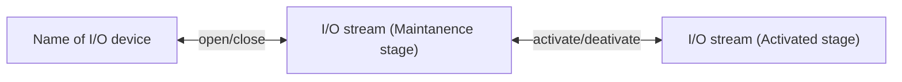

# ExternalDeviceIOs

An **experimental** definition to explicitly control external device with full performance.

This package is designed to resolve
 - absence a guideline of how to implement Julia interface to control external device
 - possible conflict of same function names between "DeviceX" and "DeviceY" packages
 - fragmentation of inferace packages

Example of the explicitly controllable I/O device are
 - cameras where framerate, trigger mode, or shutter speed can be controllable.
 - microdisplays that can save images and load them quickly in their own memory.
 - I/O device where the driver is minimally implemented, so that high-level abstraction is required by users.

It has the following common structure:

## How to use this template

Your interface package based on this should basically support
 - The definition of "name" of target devices.
 - functions `open`, `close`, and `isopen`
 - functions `activate`,`deactivate`, and `isactivated`.

It also provides an template functions to enumerate device, set device parameters, or control device while activation.

## List of package to test this package
 - [PcoCameras.jl](https://github.com/ehgus/PcoCameras.jl)
 - [ForthDimensionDisplays.jl](https://github.com/ehgus/ForthDemensionDisplays.jl)
